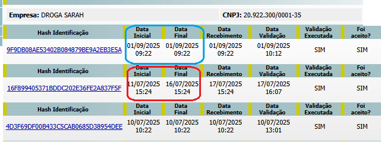

# Transmissão das movimentações

263898 - DROGARIA VIA VERDE(211)


263898 - DROGARIA VIA VERDE(211)

A cliente foi orientada a realizar o enviado das movimentações da anvisa.


Em contato com a cliente, foi esclarecido sobre o envio de movimentações retroativas no SNGPC.\
A mesma questionou se poderia transmitir novamente a movimentação do mesmo dia, porém foi informado que o sistema não permite esse procedimento, pois a transmissão considera sempre o período até a data final já enviada.

Exemplo: caso seja transmitido o período de **28/07 a 03/08**, não é possível reenviar movimentações com a data **03/08**, já que a Anvisa interpreta que este dia já está finalizado.\
Assim, qualquer receita dessa data não poderá ser incluída após o envio, sendo necessário iniciar o próximo período a partir de **04/08**.

**DIFERENÇA DO INVENTÁRIO PARA AS MOVIMENTAÇÕES NA ANVISA.**

<figure><figcaption></figcaption></figure>

**Azul: quando a DTInicial e a DTFinal são iguais quer dizer que é inventário.**

**Vermelho: quando DTInicial e a DTFinal são diferentes quer dizer que são movimentações semanais.**&#x20;

<figure><figcaption></figcaption></figure>
